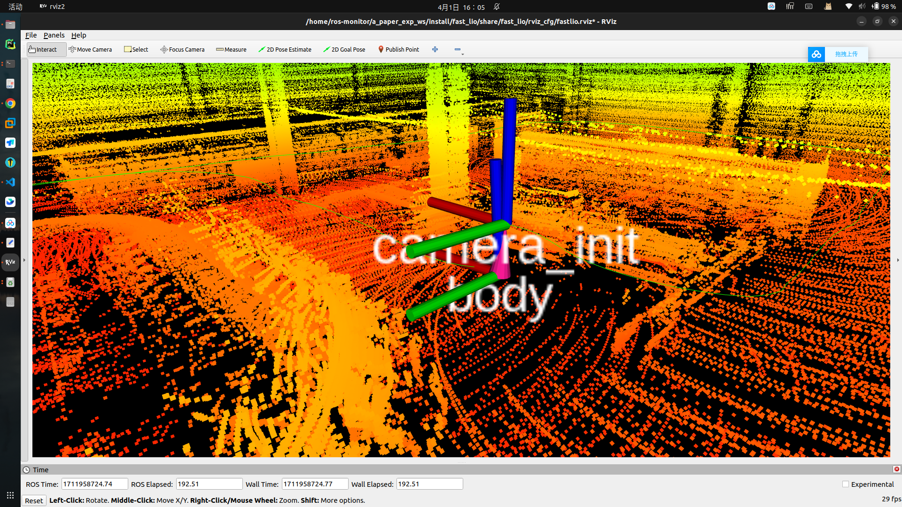
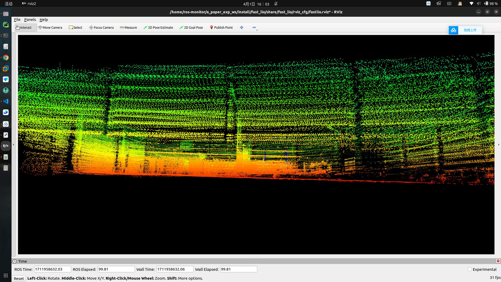
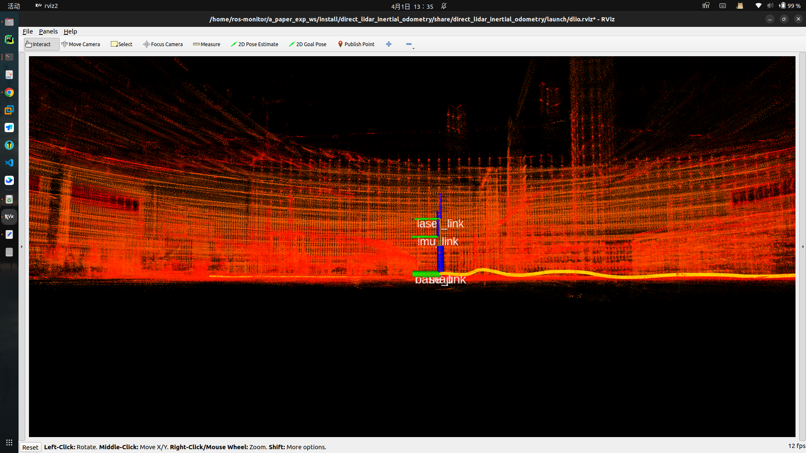
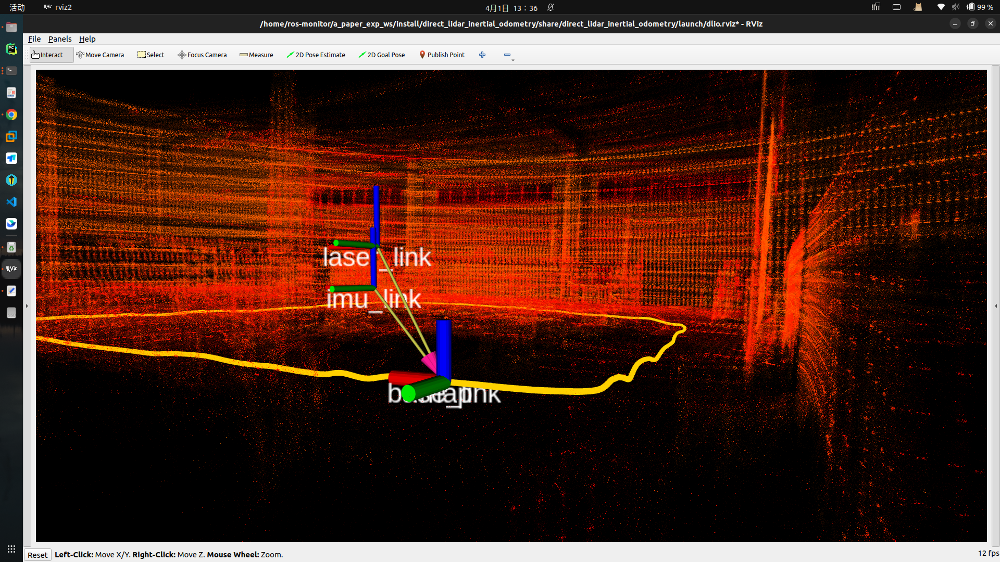
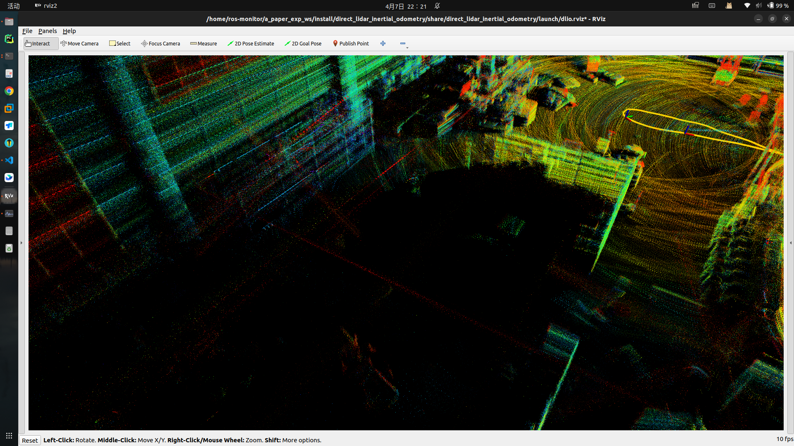
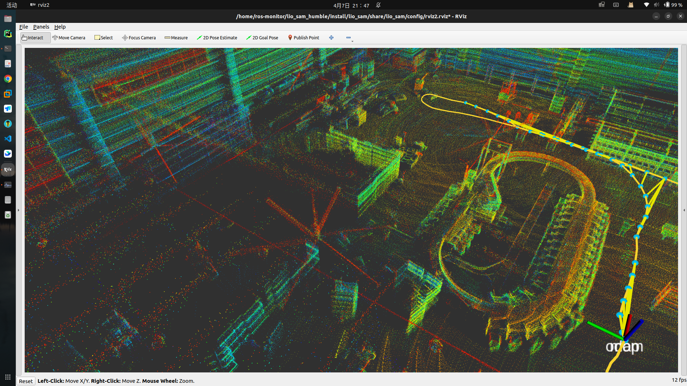
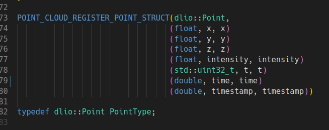

# 使用DLIO制作EgoNN的数据集

基于ROS2的DLIO，点云pcd文件输出到workspace下的bin文件夹中，目前是绝对路径，复现请对odom.cc与odom.h进行pcd_path进行review.
位姿同理，输出到workspace下的pose.yaml，修改后缀可得到txt.相应的变量是pose_yaml_file.

## DLIO与FAST-LIO青龙仓对比
缺少回环的FastLio无法完成地面一致的闭合
 

    

    

缺少回环的dlio虽然地面看起来一致，但是风扇叶片的细节看出来全局一致性还是和LIO-SAM差点

    

    

    

LIO-SAM叶片一致:

    

## 数据集下载
链接: https://pan.baidu.com/s/11qyWsf89mOseqhwGmAmdkQ 提取码: 2rs1
雷达频率20hz 点云已作畸变去除 为车体base_link下
位姿为base_link到map系下
点云格式：

    

## 编译与注明
#### Direct LiDAR-Inertial Odometry: Lightweight LIO with Continuous-Time Motion Correction(https://github.com/vectr-ucla/direct_lidar_inertial_odometry)

#### [[ IEEE ICRA ](https://ieeexplore.ieee.org/document/10160508)] [[ arXiv ](https://arxiv.org/abs/2203.03749)] [[ Video ](https://www.youtube.com/watch?v=4-oXjG8ow10)] [[ Presentation ](https://www.youtube.com/watch?v=Hmiw66KZ1tU)]

DLIO is a new lightweight LiDAR-inertial odometry algorithm with a novel coarse-to-fine approach in constructing continuous-time trajectories for precise motion correction. It features several algorithmic improvements over its predecessor, [DLO](https://github.com/vectr-ucla/direct_lidar_odometry), and was presented at the IEEE International Conference on Robotics and Automation (ICRA) in London, UK in 2023.
